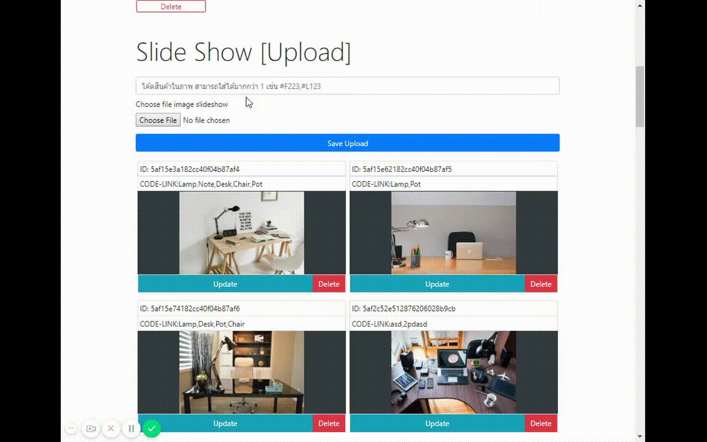

# Boonmeshop-Website
>Hi! This Project is website which developed for practice my programming skills About How to design program and operate it ;all of these idea created for Initial requirements of this project 
Assume that this website is online store has some of product which is responsive web and has systems to manage product such as ADD, MODIFY,and REMOVE etc. including systems on online store should have is filter system for customer to search for product by requirements
I have completely developed  website of frontend and backend by link them together to Send information through http protocal.
Of course that this project may have many errors if examine closely;may apologize
Thanks for reading.

<p align="center">
<strong>Built With :</strong>
<a href="https://jquery.com/">JQUERY</a> 
      • <a href="https://developer.mozilla.org/en-US/docs/Web/JavaScript/New_in_JavaScript/ECMAScript_Next_support_in_Mozilla">ECMAScript (JAVASCRIPT) </a> • <a href="https://nodejs.org/en/">NodeJS</a> • <a href="https://www.mongodb.com/">MongoDB</a> </p>
     <p align="center"> 
   
      </p>
      
   <p align="center"> </p>
     
## Design/Responsive
* Manage Layout 
  * Grid System
  * Flexbox
* Step Respon
  * Desktop 
    * working on desktop-Mode
     <p align="center"> </p>
  * tablet
    * working on Tablet-Mode
     <p align="center"> </p>
  * Mobile
    * working on Mobile-Mode
     <p align="center"> </p>
     
## Shopping Cart System
      In the part of shopping cart system or the system that add information of website will send and receive information by restful API that programmed with Nodejs and use express that have many status such as GET POST PATH and Delete; can inspect Code from
```sh
/api/routers
/api/models
```
<p align="center"> </p>

> `Handle-Data-Upload` (Add,View,Update,Delete)
<p align="center"> </p>

> `Preview-Image-Upload` (select images for upload[image_avatar,images_gallery])
  <p align="center"> </p>
  
> `Filter-Product` 
* Select by =>
    * Price(Max-Min) 
    * Type
    * Material
    * Payment
    * transport
    * status
    * Search by Name Product
      ```sh
      Can Mix All filter
      - code frontend filter
      /scripts/admin.js => product
      - code api filter
      /api/routers/product.js => get('/filter')
      ```
      <p align="center"> </p>
      
 > `Update and Delete Handle` 
      show dialog success
       <p align="center"> </p>
  
## Full height Admin Page (Shopping Cart)
<p align="center"> </p>


## FrontEnd
### language
* HTML5
* CSS3 
  * Layout (Grid ,Flexbox)
  * SCSS 
      * Tool [prepos](https://prepros.io/).
* JAVASCRIPT (Vanilla javascript).
### Framework
* [Bootstrap](https://getbootstrap.com/).
* [Jquery](https://jquery.com/).

## BackEnd
* NodeJS
  * Express
  * Mongoose
  * body-parser
  * Multer
* MongoDB


## Thank you

* [VSCODE SuperCool Best of Code Editor](https://code.visualstudio.com/)
* [่Jquery Manage Element Easy and Very Useful](https://jquery.com/)
* [Prepos tool for code scss super simple](https://prepros.io/)
* [Nodejs Superpower backEnd](https://nodejs.org/en/)
* [Express Simple Routing in BackEnd Express](https://expressjs.com/)
* [Multer Upload files Super Simple](https://github.com/expressjs/multer)
* [Mongoose Simple MongoDB Handle](http://mongoosejs.com/)
* [MongoDB Best Database](https://www.mongodb.com/)
* [Pexels Free Images](https://www.pexels.com/)

## License
 Public


