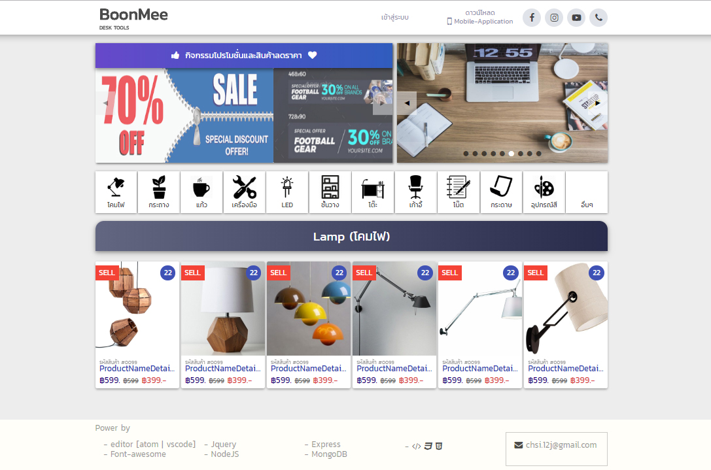
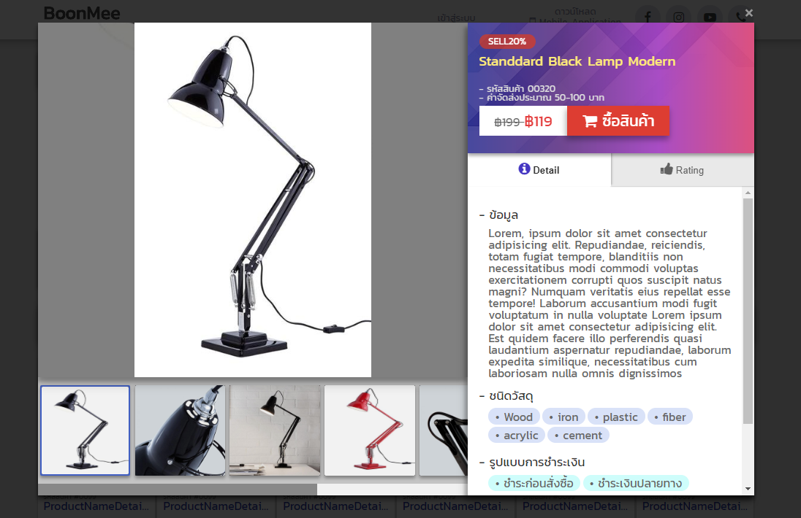
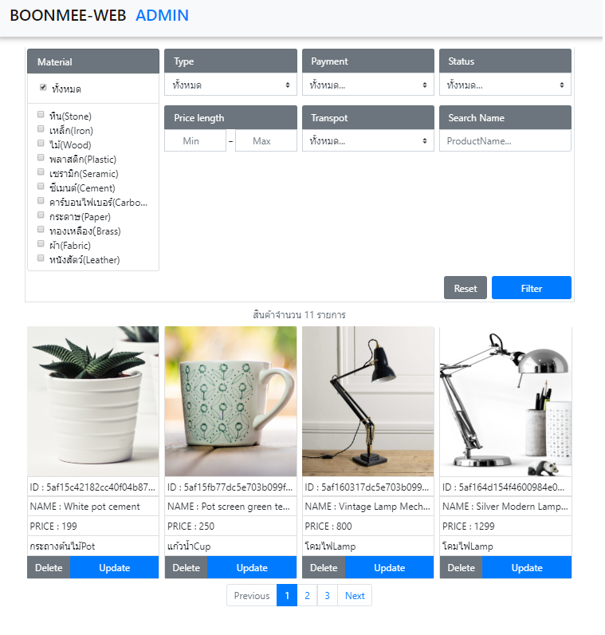
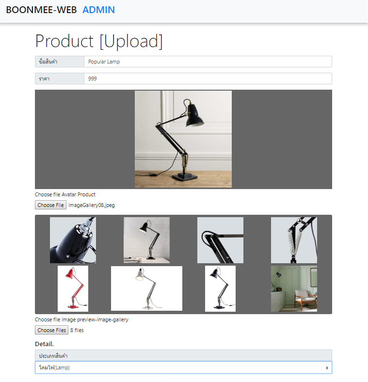

# Boonmeshop-Website
>Hi! this Project เป็นเว็บไซด์ที่พัฒนาขึ้นเพื่อฝึกทักษะด้านการโปรแกรมมิ่งของผม การออกแบบหน้าตาโปรแกรมและการทำงานทั้งหมดได้คิดอนุมารขึ้นมาเองเพื่อใช้ไปความต้องการเบื้องต้นสำหรับโปรเจ็ก เว็บไซต์ที่สร้างขึ้นนี้สมมุติให้เป็นเว็บขายของออนไลน์ที่มีสินค้าจำนวนหนึ่ง ซึ่งต้องเป็น responsive web และมีระบบต่างๆในการจัดการกับสินค้า เช่น การเพิ่ม การแก้ไข และกาลบ เป็นต้น รวมไปถึงระบบที่ร้านขายของออนไลน์ควรจะมีนั่นคือระบบกรองสินค้นเพื่อให้ผู้ใช้ค้นหาสินค้าจากความต้องการได้ ผมได้ทำการพัฒนาเว็บไซด์ทั้งทางฝั่ง frontend และ backend ทั้งหมด ให้เชื่อมโยงเข้าหากันได้โดยการส่งข้อมูลผ่าน http protocal ซึ่งแน่นอนว่า โปรเจ็กนี้อาจมีข้อผิดพาดจำนวนมากหากเข้าไปตรวจสอบในเชิงลึกจริงๆ ต้องขออภัยนะที่นี้ด้วย ขอบคุณที่รับชม.

<p align="center">
<strong>Built With :</strong>
<a href="https://jquery.com/">JQUERY</a> 
      • <a href="https://developer.mozilla.org/en-US/docs/Web/JavaScript/New_in_JavaScript/ECMAScript_Next_support_in_Mozilla">ECMAScript (JAVASCRIPT) </a> • <a href="https://nodejs.org/en/">NodeJS</a> • <a href="https://www.mongodb.com/">MongoDB</a> </p>
     <p align="center"> 
   
      </p>
      
   <p align="center"> </p>
     
## Design/Responsive
* Manage Layout 
  * Grid System
  * Flexbox
* Step Respon
  * Desktop 
    * working on desktop-Mode
     <p align="center"> </p>
  * tablet
    * working on Tablet-Mode
     <p align="center"> </p>
  * Mobile
    * working on Mobile-Mode
     <p align="center"> </p>
     
## Shopping Cart System
      ในส่วนของระบบตะก้าสินค้า หรือ ระบบเพิ่มข้อมูลของเว็บไซด์จะส่งและรับข้อมูลผ่าน restful API ที่เขียนด้วย Nodejs และใช้ express
      จะมีสถานะต่างๆ คือ GET POST PATH และ DELETE สามารถดู Code ได้จาก
```sh
/api/routers
/api/models
```
<p align="center"> </p>

> `Handle-Data-Upload` (Add,View,Update,Delete)
<p align="center"> </p>

> `Preview-Image-Upload` (select images for upload[image_avatar,images_gallery])
  <p align="center"> </p>
  
> `Filter-Product` 
* Select by =>
    * Price(Max-Min) 
    * Type
    * Material
    * Payment
    * transport
    * status
    * Search by Name Product
      ```sh
      Can Mix All filter
      - code frontend filter
      /scripts/admin.js => product
      - code api filter
      /api/routers/product.js => get('/filter')
      ```
  
## Full height Admin Page (Shopping Cart)
<p align="center"> </p>


## FrontEnd
### language
* HTML5
* CSS3 
  * Layout (Grid ,Flexbox)
  * SCSS 
      * Tool [prepos](https://prepros.io/).
* JAVASCRIPT (Vanilla javascript).
### Framework
* [Bootstrap](https://getbootstrap.com/).
* [Jquery](https://jquery.com/).

## BackEnd
* NodeJS
  * Express
  * Mongoose
  * body-parser
  * Multer
* MongoDB

## License
 Public


